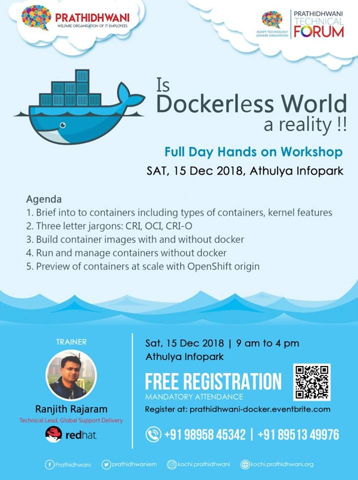

# Is Dockerless world a reality ?
Workshop on 15-December.  Hosted by Prathidhwani Kochi @ Ahulya InfoPark

## Prerequisites
- Laptop should be capable enough to run atleast one Fedora/Centos 7 VM instance.
    - 2 GB of RAM should be allocated for the VM
    - 1 vCPU should be allocated for the VM
    - Atleast 7GB of free space should be available on the partition where the VM image is downloaded or resides. 
- Laptop should have Hypervisors installed Like VirtualBox,HyperV, KVM or Vmware Workstation
- Download the prebuilt image or download Fedora/Centos cloud image or install the required packages in your existing Virtual  
  machine. Choose one of the below methods
    
    - [Prebuilt Fedora 29 Images for the workshop](#Prebuilt-Image-Downloads)
  
    - [Using Fedora 29/Centos 7 cloud images](#Cloud-images-for-KVM)
  
    - [Package installation instruction for your existing Centos 7/Fedora 29VM](#Package-Installation-Instruction)
  
  

## Prebuilt Image Downloads

Import this prebuilt image and create a new virtual machine

Image format| OS  | hypervisor | Image download Link
------------| ----|------------|-------
Qcow2| Linux | KVM| https://goo.gl/fywwKG
VDI|Windows|VirtualBox|https://goo.gl/Ne6W5b
VDI|Linux|VirtualBox|https://goo.gl/Ne6W5b

### Credentials
~~~
username: root
password: passw0rd
~~~

## Cloud images for KVM

Outline

- Download Fedora 29 or Centos7 cloud image from the links given below
- Either download a prebuilt cloud init image or prepare one
- Before booting the VM for the first time, cloud init iso image should be attached to the VM
- Credentials for login: username:        passowrd

Image format| OS  | hypervisor | Image download Link|Credentials
------------| ----|------------|--------------------|------------
Qcow2| Linux | KVM| [Fedora 29 qcow2 Size 230MB](https://download.fedoraproject.org/pub/fedora/linux/releases/29/Cloud/x86_64/images/Fedora-Cloud-Base-29-1.2.x86_64.qcow2)| user: fedora password:passw0rd [sudo enabled]
Qcow2|Linux|KVM|[Centos 7 qcow2 Size 252MB](https://cloud.centos.org/centos/7/images/CentOS-7-x86_64-GenericCloud.qcow2.xz)| user:centos password:passw0rd [sudo enabled]

- Create Cloud-init ISO file

You can use the pre-built cloud-init iso image by clicking [here](https://github.com/ranjithrajaram/prathidhwaniworkshop/blob/master/cloud-init-workshop.iso?raw=true). If you are downloading the pre-built cloud init image, then proceed to [Creating Virtual Machine](#creating-the-virtual-machine)

- Steps for Preparing cloud init image 

Create a directory and two files should be created with the following contents. For example, path shown here is `/vm`. Replace the path as per your system configuration

~~~
        mkdir -p /vm/workshop
        cd /vm/workshop
~~~

The first file should be named as `user-data`. Include the following contents. Note password for the debian user is set as `passw0rd`. Change the password as required.

~~~
#cloud-config
password: passw0rd
chpasswd: { expire: False }
ssh_pwauth: True
~~~

Create another file called `meta-data`. Include the following contents. Hostname of the VM is set as `debian-node-0`

~~~
instance-id: workshop0
local-hostname: workshop-node-0
~~~
- Create an ISO image using the two files. Execute the following command. This will create an iso image called `cloud-init-workshop.iso`. `genisoimage` package should be installed on the system.
~~~
genisoimage -output cloud-init-workshop.iso -volid cidata -joliet -rock user-data meta-data
~~~
- Download the cloud based image to `/vm/workshop`

### Creating the Virtual Machine

- Create the VM instance using command line tool. Package `virt-install` should be installed on the node. In the below command, modify the path mentioned after `--disk`. You have to modify two --disk paths. First path should point to qcow2 image.
~~~
virt-install --import --name workshopvm --memory 2048 --vcpus 1 --disk /vm/workshop/Fedora-Cloud-Base-29-1.2.x86_64.qcow2,format=qcow2,bus=virtio --disk /vm/workshop/cloud-init-workshop.iso,device=cdrom --network bridge=virbr0,model=virtio  --noautoconsole
~~~

- Execute `virt-manager` to access the VM or `virsh console workshopvm`. In the virsh command, `workshopvm` was the name of the VM that was created using the `virt-install` command. To exit from `virsh command`, use `CTRL+]`
- To login to the virtual machine, use the credentials mentioned in the above table.
- Proceed to Package installation Instruction mentioned below

## Package Installation Instruction

~~~
yum install podman buildah docker skopeo
~~~

